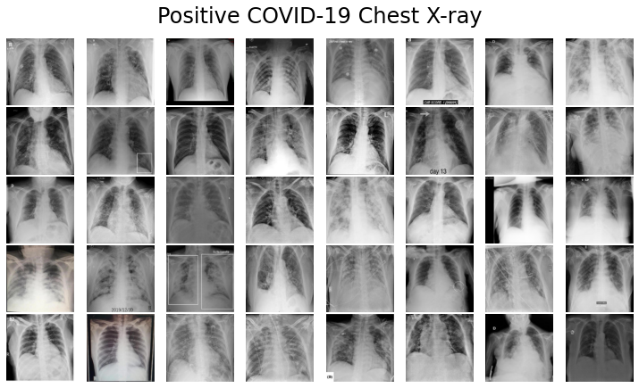

# COVID-19 Detection Web App from Chest X-rays
A web app to detect COVID-19 based on given Chest X-rays is developing using transfer learning and deployed using Falsk and Docker. The models were trained for a few epochs on around 15264 (512x512) Chest X-rays on Google Colab GPU. 

# Data Set
This dataset consists of 15264 (512x512) chest X-ray images from a Kaggle competition:
https://www.kaggle.com/competitions/stat946winter2021/data%22

The dataset contains positive and negative classes to indicate the positive and negative COVID-19 cases. You can find some examples of this dataset below: 

# Technical Concepts in Model development
- **Data Loader**: Since all data couldn't be loaded into memory, data loaders from pytorch are used. A data loader combines a dataset and a sampler, and provides an iterable over the given dataset. 
- **Mixup Data Augmentation**: mixup is a domain-agnostic data augmentation technique proposed in mixup: Beyond Empirical Risk Minimization by Zhang et al. It's implemented with the following formulas:

(Note that the lambda values are values with the [0, 1] range and are sampled from the Beta distribution.)
- **Transfer Learning**: It is a popular approach in deep learning where pre-trained models are used as the starting point on computer vision and natural language processing tasks given the vast compute and time resources required to develop neural network models on these problems and from the huge jumps in skill that they provide on related problems.

